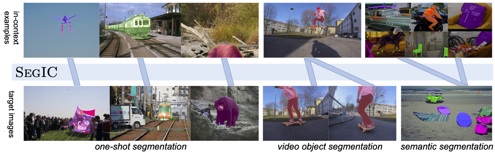

# SEGIC: Unleashing the Emergent Correspondence for In-Context Segmentation

### [Paper (ArXiv)](https://arxiv.org/abs/2311.14671)


We introduce SEGIC, an end-to-end segment-in-context framework built upon a single frozen vision foundation model.



## Model ZOO

| Model  | Backbone | Iters |  Config | Download |
| ------ | -------- | ------- | ----- | ----- |
| SEGIC | DINOv2-l | 80k*12e | [config](scripts/segic_dist.sh) | [model](https://huggingface.co/menglc/SEGIC/blob/main/segic_dinov2_l_80kx12e.pth)
| SEGIC | DINOv2-l | 160k*12e | [config](scripts/segic_dist.sh) | [model](https://huggingface.co/menglc/SEGIC/blob/main/segic_dinov2_l_160kx12e.pth)


## Environment Setup
```
conda create --name segic python=3.10 -y
conda activate segic
pip install torch==1.13.1+cu117 torchvision==0.14.1+cu117 torchaudio==0.13.1 --extra-index-url https://download.pytorch.org/whl/cu117
pip install -r requirements.txt
```

## Train SEGIC
```
bash scripts/segic_dist.sh 8 dinov2 OUTPUT/all_exps/abs_backbone/dinov2_l --dinov2_model l --samples_per_epoch 80000
```

## Evaluate SEGIC

### Download Datasets


The dataset should be organized as:
```
data
├── COCO2014
│   ├── annotations
│   ├── train2014
│   └── val2014
├── DAVIS
│   ├── 2016
│   └── 2017
├── FSS-1000
│   ├── abacus
│   ├── abe's_flyingfish
│   ├── ab_wheel
│   ├── ...
└── ytbvos18
    └── val

```

### Evaluate One-shot Segmentation
```
# coco
bash scripts/segic_dist.sh 8 dinov2 OUTPUT/all_exps/abs_backbone/dinov2_l --eval --restore-model /your/ckpt/path --eval_datasets coco

# fss
bash scripts/segic_dist.sh 8 dinov2 OUTPUT/all_exps/abs_backbone/dinov2_l --eval --restore-model /your/ckpt/path --eval_datasets fss
```

### Evaluate Zero-shot Video Object Segmentation
```
# davis-17
bash scripts/segic_dist.sh 8 dinov2 OUTPUT/all_exps/abs_backbone/dinov2_l --eval_vos --vos_data davis17 --restore-model /your/ckpt/path

# youtubevos-18
bash scripts/segic_dist.sh 8 dinov2 OUTPUT/all_exps/abs_backbone/dinov2_l --eval_vos --vos_data youtube --restore-model /your/ckpt/path
```

### Custom Inference
```
bash scripts/segic_dist.sh 1 dinov2 OUTPUT/all_exps/abs_backbone/dinov2_l --custom_eval --restore-model /your/ckpt/path
```

## Acknowledgement
Many thanks to these excellent opensource projects
* [Segment Anything](https://github.com/facebookresearch/segment-anything)  
* [SAM-HQ](https://github.com/SysCV/sam-hq) 

## Citation
If you find this project useful for your research, please use the following BibTeX entry.
```bibtex
@inproceedings{meng2023segic,
  title={SEGIC: Unleashing the Emergent Correspondence for In-Context Segmentation},
  author={Meng, Lingchen and Lan, Shiyi and Li, Hengduo and Alvarez, Jose M and Wu, Zuxuan and Jiang, Yu-Gang},
  journal={ECCV},
  year={2024}
}