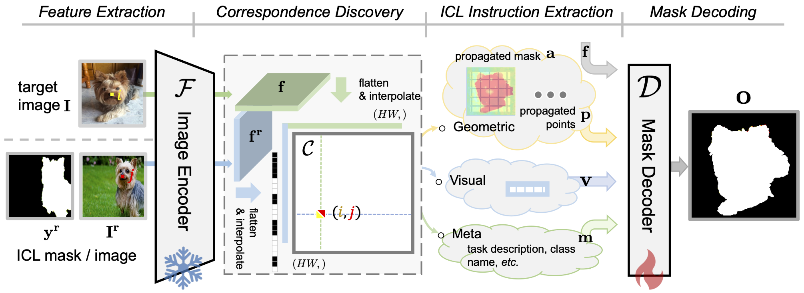

# SEGIC: Unleashing the Emergent Correspondence for In-Context Segmentation
We introduce SEGIC, an end-to-end segment-in-context framework built upon a single frozen vision foundation model.

# Model framework

